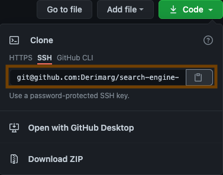
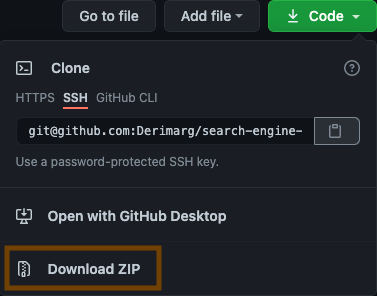

# [Search Engine Optimization](https://derimarg.github.io/search-engine-optimization)


## Description

Search ranking for your business increase your advertising costs decrease, and you no longer need to advertise your page.

> 1. **Seach Engine**

The dominance of internet use means that users are searching for the right business as they travel, shop, or sit on their couch at home. Search Engine Optimization (SEO) allows you to increase your visibility and find the right customers for your business.

> 2. **Online Reputatiion Management**

The web is full of opinions, and some of these can be negative. Social media allows anyone with an internet connection to say whatever they want about your business. Online Reputation Management gives you the control over what potential customers see when they search for your business.

> 3. **Social Media Marketing**

Social media continues to have a sizable influence on buying habits. Social media marketing helps you determine which platforms are suited to your brand, using analytics to find the right markets and increase your lead generation.

---

### Table of Contents

- [Description](#description)
- [Download](#how-to-download)
- [License](#license)
- [Author Info](#author-info)

---

#### Technologies
- CSS
- 

[Back To The Top](#search-engine-optimization)

---

>## How To Download

- Simply copy the **SSH** :



or Download the **ZIP File**:



>## Installation

 Use the follow command at your terminal, **git clone** (Create a working copy of a local repository):

```html
git clone git@github.com:Derimarg/search-engine-optimization.git
```

After cloned the repository, create your own repository, copy the files to your repository and type in your terminal the follow commands. 

```html
git status

git add -A

git commit -m "Message to commit."

git push or git push origin main
```

[Back To The Top](#search-engine-optimization)

---

## References

- GitHub - [James Q Quick](https://github.com/jamesqquick)

> https://github.com/jamesqquick/read-me-template

[Back To The Top](#search-engine-optimization)

---

## License

MIT License

Copyright (c) [2021] [Derimar Gray]

Permission is hereby granted, free of charge, to any person obtaining a copy
of this software and associated documentation files (the "Software"), to deal
in the Software without restriction, including without limitation the rights
to use, copy, modify, merge, publish, distribute, sublicense, and/or sell
copies of the Software, and to permit persons to whom the Software is
furnished to do so, subject to the following conditions:

The above copyright notice and this permission notice shall be included in all
copies or substantial portions of the Software.

THE SOFTWARE IS PROVIDED "AS IS", WITHOUT WARRANTY OF ANY KIND, EXPRESS OR
IMPLIED, INCLUDING BUT NOT LIMITED TO THE WARRANTIES OF MERCHANTABILITY,
FITNESS FOR A PARTICULAR PURPOSE AND NONINFRINGEMENT. IN NO EVENT SHALL THE
AUTHORS OR COPYRIGHT HOLDERS BE LIABLE FOR ANY CLAIM, DAMAGES OR OTHER
LIABILITY, WHETHER IN AN ACTION OF CONTRACT, TORT OR OTHERWISE, ARISING FROM,
OUT OF OR IN CONNECTION WITH THE SOFTWARE OR THE USE OR OTHER DEALINGS IN THE
SOFTWARE.

[Back To The Top](#search-engine-optimization

---

## Author Info

- GitHub - [Derimar Gray](https://github.com/Derimarg)

[Back To The Top](#search-engine-optimization)